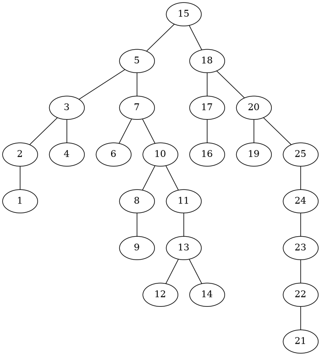
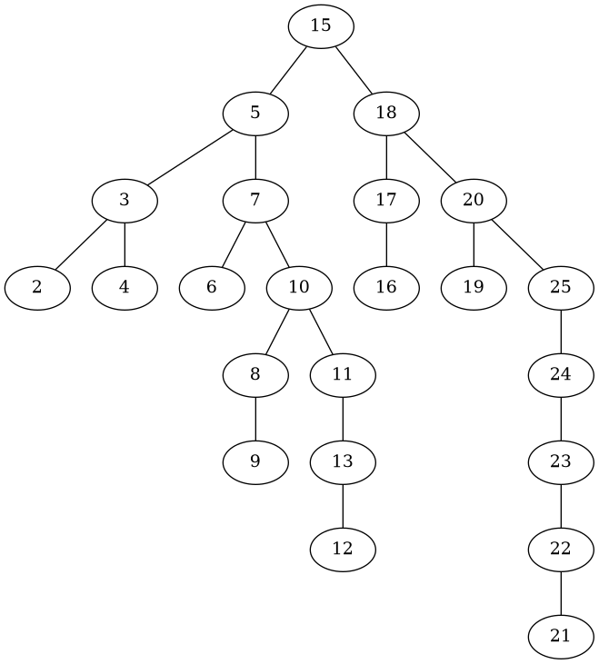
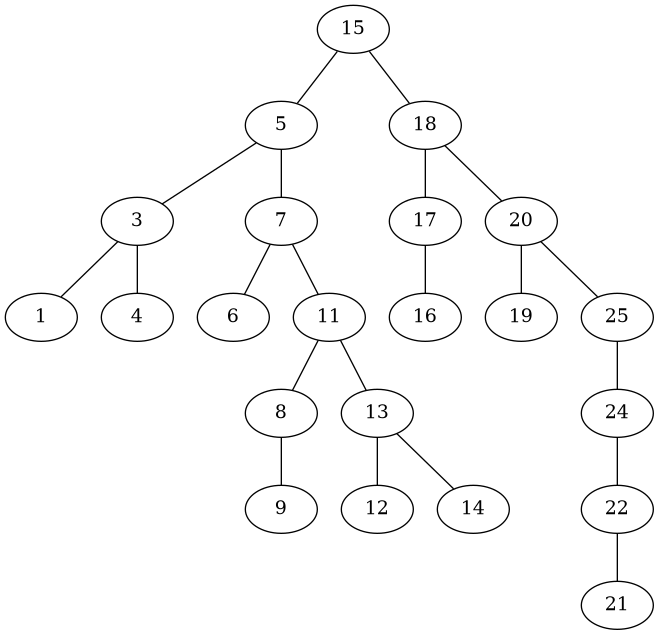
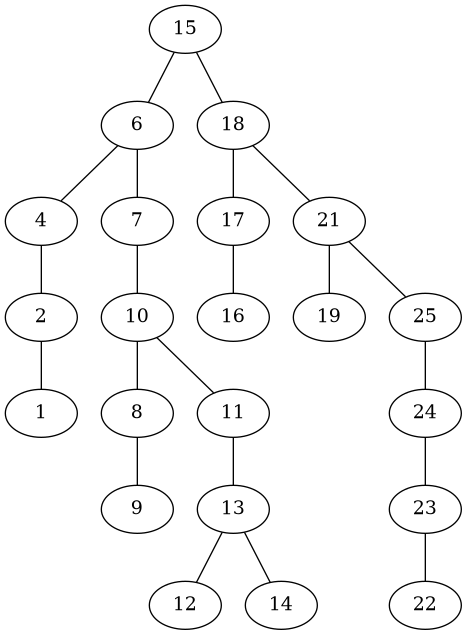

# Assignment 4: Binary Search Tree in Rust

[](https://classroom.github.com/a/B7FTXFRS)

## Collaborator

Name: Muhammad Reyhan Arighy

SID: 1313623078

## Overview

A comprehensive Binary Search Tree (BST) implementation with an interactive CLI, advanced pointer management, and visualization capabilities.

## Features

### Tree Operations

- Insert nodes
- Delete nodes
- Find node successor
- Find tree root
- Find minimum/maximum nodes
- Visualize tree structure using Graphviz DOT files

### Technical Highlights

- Advanced Rust pointer management (`Rc`, `RefCell`)
- Detailed logging with `env_logger`
- Interactive command-line interface
- Tree graph generation

## Project Structure

```rust
src/
├── main.rs # CLI and user interaction
├── structure/
│ ├── bst.rs # BST implementation
│ └── tree.rs # Tree base structures
└── tool/ # Utility modules
  └── mod.rs # Includes graph generation
```

## Dependencies

- `std::rc::Rc`
- `std::cell::RefCell`
- `env_logger`
- `log`

## Usage

### Interactive Mode

1. Run the program
2. Choose between:

   - Use a predefined graph
   - Create a new graph from scratch

### Available Operations

- Insert nodes
- Delete nodes
- Find node successor
- Get tree root
- Find minimum/maximum nodes
- Save tree graph as DOT file

## Predefined Graph



The predefined graph provided as shown in the image above serves as an excellent initial test, offering a constructed binary search tree that systematically exercises various deletion scenarios across different tree depths and node configurations.

### Comprehensive Delete Scenario Verification

#### Case 1: Node with No Children (Leaf Node)



In the predefined graph, deleting leaf nodes (such as nodes with key values 1 and 14) demonstrates the binary search tree's delete operation successfully as shown in the image above. The resulting graph visually confirms that:

- [ ] Delete a leaf node as the left child
- [ ] Delete a leaf node as the right child
- [ ] Delete the root when it's a leaf

#### Case 2: Node with One Child



In the predefined graph, deleting nodes with one child (such as nodes with key values 2, 10, and 23) demonstrates the binary search tree's delete operation successfully as shown in the image above. The resulting graph visually confirms that:

- [ ] Delete a node with only a left child
  - [ ] Node is left child of parent
  - [ ] Node is right child of parent
  - [ ] Node is root
- [ ] Delete a node with only a right child
  - [ ] Node is left child of parent
  - [ ] Node is right child of parent
  - [ ] Node is root

#### Case 3: Node with Two Children (Successor Replacement)



In the predefined graph, deleting nodes with one child (such as nodes with key values 3, 5, and 20) demonstrates the binary search tree's delete operation successfully as shown in the image above. The resulting graph visually confirms that:

Tricky Case with Two Sub-scenarios:

##### Scenario A: Successor is Direct Right Child

- [ ] Successor is immediate right child
- [ ] Successor's right child exists
- [ ] Successor's right child is None

##### Scenario B: Successor is Deeper in Right Subtree

- [ ] Successor is not the immediate right child
- [ ] Successor has a right child
- [ ] Successor has no right child
- [ ] Successor is deep in the right subtree

#### Edge Cases to Consider

- [ ] Delete root node with two children
- [ ] Delete last remaining node
- [ ] Verify BST properties maintained after deletion
- [ ] Handle duplicate key scenarios

### Complexity Analysis

- **Time Complexity**: O(h), where h is tree height
- **Space Complexity**: O(1), in-place modification

### Test Generation Strategy

1. Generate random trees
2. Perform deletions
3. Validate:
   - Tree structure
   - BST properties
